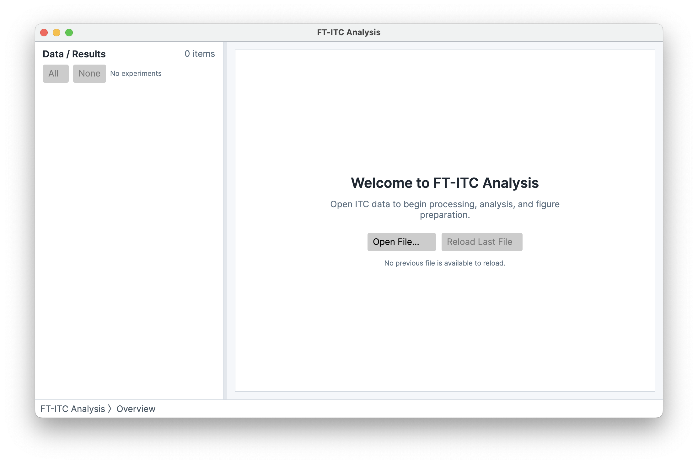
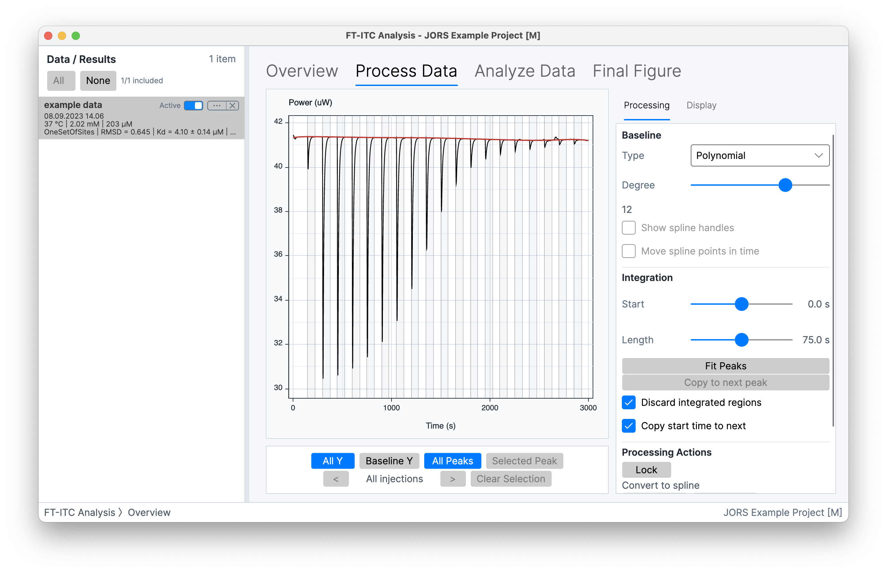
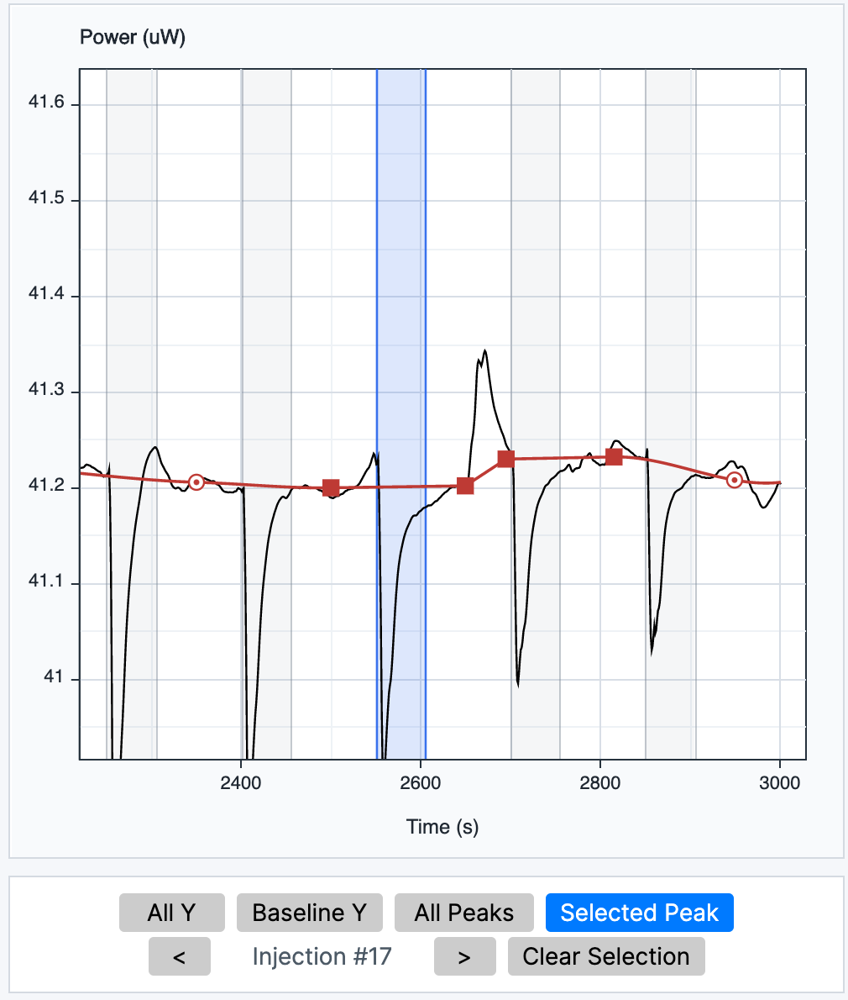
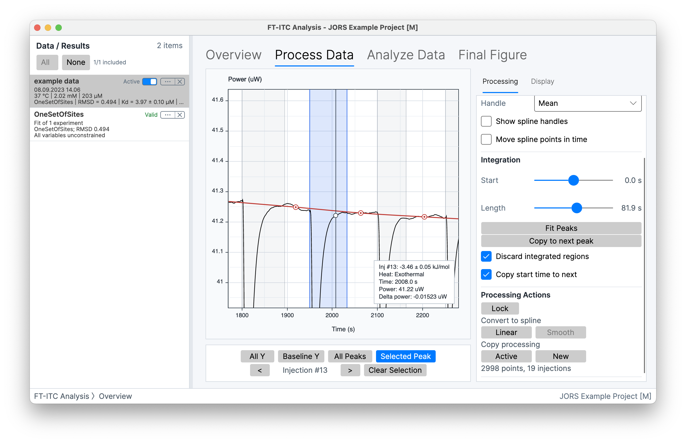
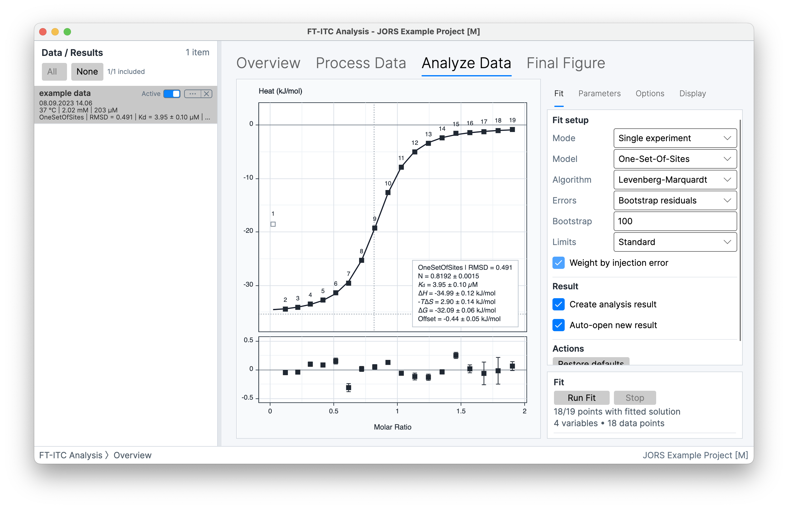
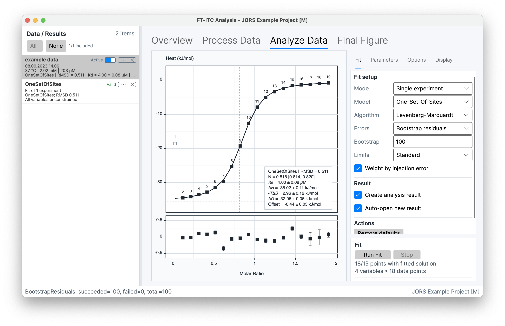
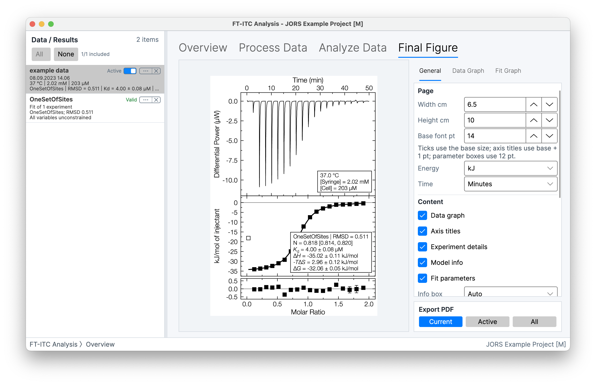

# How to Analyze ITC Data: From Thermogram to Binding Parameters

Isothermal titration calorimetry data analysis is a chain of decisions: inspect the raw thermogram, establish a defensible baseline, integrate injection peaks, account for matched background or dilution heat, fit a model that reflects the experiment, and review residuals and uncertainty before interpreting the parameters. This is a practical, decision-led walkthrough in FT-ITC Analysis — not a claim that one attractive curve validates the model or experiment.

> **How to edit this file**
>
> Edit the headings, prose, lists, links, image captions, and image choices in plain Markdown. The website will keep its visual layout when this is translated back to HTML. If you want a different image crop or annotation, write a short note directly beneath the image. When you are ready, say “sync the tutorial Markdown” and I will apply your edited content to the website page.

> **What this tutorial is — and is not**
>
> The screenshots use a representative FT-ITC Analysis project to show where decisions are made. They are not a validation dataset or a numerical result to reproduce. Keep your own instrument file, experimental record and controls alongside every processing decision.

## The short version

1. **Import and check the experiment.** Confirm the sample and titrant, concentrations, temperature, injection settings, units and available reference experiment before changing the data.
2. **Inspect the thermogram.** Look for stable between-injection regions, plausible peak shapes, baseline drift, irregular injections and signals that may reflect mixing or dilution.
3. **Set the baseline and integrate.** Choose a baseline representation, inspect each integration boundary, then check the resulting heat series before fitting an isotherm.
4. **Correct background heat when justified.** Use a matched buffer or dilution experiment when the design supports it, and distinguish a physical correction from a model offset.
5. **Fit, review and export.** Fit a model that reflects the chemistry, review residuals and conditional uncertainty, save the project, and export a result that retains its analytical context.

---

## 1. Import and experiment context

### Open the experiment and verify what the file contains

Before asking what a fitted parameter means, distinguish the different data products that appear during an ITC workflow and verify the experimental metadata that determines them.

#### Raw thermogram

The thermogram records differential power over time. Each injection produces a peak whose direction and size depend on the heat associated with the experiment and the instrument convention.

#### Integrated heats

Peak integration assigns an area to each injection after baseline handling. Those values can contain binding heat as well as mixing, dilution, buffer mismatch, temperature-equilibration and other contributions.

#### Binding isotherm and parameters

The integrated heats are plotted against a concentration or molar-ratio coordinate to form a binding isotherm. A selected model then estimates quantities such as _K_d or _K_a, stoichiometry and enthalpy. These are model-dependent estimates, not direct readings from the raw trace.

When you import an experiment, verify cell and syringe identities, sample and titrant concentrations, temperature, buffer and salt composition, injection volume and spacing, units, and whether a matched reference or dilution measurement exists. Those entries set the molar-ratio axis and influence the fitted parameters.

> **Match the workflow to the input**
>
> - **Raw thermogram inputs:** MicroCal-style `.itc`, TA NanoITC `.nitc`, NanoAnalyze `.ta`, and PEAQ-ITC `.apj` imports enter the thermogram-processing workflow. A PEAQ project supplies the raw thermogram and injection information from its first experiment; process and fit that restored raw data in FT-ITC Analysis rather than assuming its earlier PEAQ processing or fit was imported.
> - **Integrated-heats inputs:** compatible `.dat`, `.aff` and `.dh` files begin with experiment details and fitting, because they do not contain a thermogram for baseline correction, peak integration, or processing-derived injection uncertainty.
> - **Project inputs:** current `.ftxtc` projects preserve the working analysis context, while legacy `.ftitc` projects remain openable.
>
> [Read the full file-format reference](https://ft-itc.org/manual/installation-files-projects#supported-input-formats)

*Start with **Open File…**, then check the experiment context before changing the data.*

<!-- Website layout note: a compact crop focuses on the Open File control. -->

---

## 2. Thermogram processing

### Inspect the thermogram before changing it

Good ITC thermogram analysis begins with inspection, not automatic fitting. Review stable regions between injections, the approximate direction and shape of each peak, baseline drift, slow return to baseline, irregular or missing injections, and any change that appears only after a particular addition.

Look closely at the first injection as well as the later series. If it behaves differently, investigate the injection window, equilibration and recorded metadata; do not discard it merely because it is inconvenient. If you later exclude an injection from a fit, record why and rerun the fit after the change.

A clean-looking trace is not by itself evidence of a valid binding experiment. A signal can also reflect dilution, aggregation, precipitation, buffer mismatch, a concentration error or instrument behaviour. Use the thermogram to decide where processing needs attention; do not adjust the trace only to create a preferred-looking isotherm.

[Read the processing controls in the manual](https://ft-itc.org/manual/processing-thermograms)

*In the Process Data workspace, read the black thermogram trace, red baseline and processing controls together.*

<!-- Website layout note: use a wide crop that keeps the trace, red baseline, and right-hand controls legible. -->

---

## 3. Baseline correction

### Set a baseline before you look at the heats

The baseline estimates the non-injection power underneath a signal that is only directly observed between injections. It can therefore influence every integrated heat that follows, and the application cannot decide whether a particular baseline is scientifically appropriate for your experiment.

#### Choose a representation that matches the observed drift

Use **Polynomial** for smooth global drift, **Spline** when direct graphical control is useful, or **Segmented** for locally changing baseline behaviour. More flexibility can follow genuine drift, but it can also follow noise or absorb part of an injection response.

#### Anchor the baseline in usable regions between peaks

Identify where the instrument has returned towards its local baseline. In a Spline baseline, make the assumption visible through the editable points; do not place or move them to create the heat series you expect from a model.

#### Check what a changed boundary also changes

When **Discard integrated regions** is enabled, data inside the integration regions are omitted when the baseline is recalculated. Moving a boundary can then change both the integrated area and the estimated baseline — not just one number.

*The red baseline and control points make the local processing assumption visible. Review them against the trace, not against a preferred isotherm.*

<!-- Website layout note: use a close, near-square crop centred on the baseline and control points. -->

---

## 4. Peak integration

### Integrate every injection deliberately

Integration turns the processed thermogram into the heats used for fitting. Treat the start and end of each selected region as part of the measurement, not as a way to repair an inconvenient result.

#### Inspect the Start and Length boundaries

Use the selected-peak view to check that the interval captures the intended response without extending unnecessarily into neighbouring recovery or baseline noise. Inspect more than one peak, including any atypical first or late injection.

#### Use endpoint tools as a starting point, not a verdict

**Fit Peaks** estimates integration end points from the decay of the baseline-corrected response; it does not fit the binding isotherm or choose a permanent integration mode. **Copy to next peak** can speed a defensible repeating rule, but every copied boundary still needs inspection.

#### Keep integration choices separate from fit exclusions

Excluding a point in **Analyze Data** prevents that injection from contributing to the fit, while keeping it visible for review. It does not rerun the fit automatically, so record the reason and choose **Run Fit** again before interpreting the changed result.

After integration, review the complete heat series against the thermogram: direction and scale, changes across the titration, outliers, late-injection behaviour and any unexplained jump. There is no automatic baseline or integration rule that is correct for every experiment.

[Read about integration regions and processing-derived error](https://ft-itc.org/manual/processing-thermograms#integration-regions)

*The blue interval is one selected injection. Use it to check the local integration decision, then review the same rule across the series.*

<!-- Website layout note: use a close crop focused on the selected injection, blue interval, and measured heat. -->

---

## 5. Background heat

### Decide whether a buffer or dilution correction is justified

Integrated heats do not automatically equal binding heats. A matched reference can help estimate heat from buffer mismatch, dilution or mixing, but the right correction depends on how the experiment was designed and what the control actually measures.

Distinguish a physical reference subtraction from a mathematical offset in a binding model. A fitted offset can account for a consistent background term; it does not replace a well-designed control experiment.

> **Before subtracting a reference**
>
> Check that the cell and syringe contents, buffer, concentration range, temperature and injection schedule are sufficiently matched for the intended comparison. FT-ITC Analysis offers **Matched**, **Linear** and **Exp. decay** reference models. Choose one that represents the available control, retain the reference data, and note how the correction changes both the heat series and its uncertainty.
>
> [Read the buffer-subtraction workflow](https://ft-itc.org/manual/additional-tools#buffer-subtraction)

---

## 6. Binding-model fitting

### Fit an ITC binding model, not just a curve

Open **Analyze Data** in **Single experiment** mode only after the integrated heats and experiment details are ready. The screen shown here uses **One-Set-Of-Sites** as a teaching example; it represents equivalent, independent sites and is not a universal default.

FT-ITC Analysis also documents **Two-Sets-Of-Sites**, **Competitive Binding** and **Dissociation** models. Select only a model whose assumptions match the chemistry and experimental design. A lower fitting loss or attractive curve does not by itself establish that a more complex model is supported.

The fit uses the included injections together with concentrations, injection volumes, cell volume, temperature and model-specific information. Check units, concentrations, starting values, limits and weighting before **Run Fit**. Apparent stoichiometry alone cannot distinguish a concentration error from other effects that change the fitted value.

For two or more processed **Active** experiments, **Multiple experiments** can retain member-specific parameters or apply scientifically justified **Same for all** or **Temperature dependent** constraints. A combined result should still be read with every member curve and residual in view; see the [multiple-experiment fitting guide](https://ft-itc.org/manual/multiple-experiments) for the constraint details.

[Read the documented model assumptions](https://ft-itc.org/manual/fitting-models#models)

*The fit view keeps the selected model, isotherm, residuals, weighting and error method in the same evidence chain.*

<!-- Website layout note: use a wide crop that keeps model selection, isotherm, residuals, weighting, and the error method readable. -->

---

## 7. Fit quality and uncertainty

### Read residuals, processing-derived error and resampling together

A fitted parameter is more useful when the evidence around it is visible. Review the data, model, residuals and uncertainty as one result rather than reducing the analysis to a single goodness-of-fit statistic.

#### Look for structure in the residuals

Residuals show the difference between observed integrated heats and model-predicted heats. Check whether they are broadly scattered around zero or instead show curvature, a trend, clusters or one injection that dominates the fit. Structured residuals can indicate an unsuitable model, processing choice or experimental problem.

#### Know what injection-error weighting represents

For processed thermograms, each injection error bar is an estimated ±1 standard deviation from local baseline-corrected noise, time correlation, integration length and baseline uncertainty. **Weight by injection error** uses that processing-derived estimate in the fitting objective. Integrated-heats imports do not provide this thermogram-derived estimate.

#### Read resampling intervals conditionally

**Bootstrap residuals** creates synthetic datasets from the fit residuals and refits them; the reported interval is calculated around the primary solution rather than replacing it with a resampled average. **Leave-one-out** is a different reduced-data refit. State which method and interval you show.

#### Keep the wider error budget in view

Repeat key decisions one at a time: baseline representation, integration boundaries, injection inclusion, reference correction and model choice. Fitted uncertainty does not automatically cover concentration error, sample heterogeneity, baseline bias, systematic instrument effects or model misspecification.

[Read the uncertainty and diagnostic definitions](https://ft-itc.org/manual/fitting-models#parameter-uncertainty)

*Review fitted values and intervals with the residual plot and the successful and failed bootstrap-refit counts, rather than interpreting one reported number in isolation.*

<!-- Website layout note: keep the parameter intervals, residuals, and bootstrap status line legible. -->

---

## 8. Reporting

### Export a traceable ITC result

A publication figure should make the relationship between the raw signal, integrated heats, fitted model and residuals legible. Do not export only a final parameter table when the processing choices determine how that table was produced.

Save a processed `.ftxtc` project before fitting if you need a reusable processing checkpoint, then save again after fitting to retain the solution and any Analysis Result. Retain the original input file, baseline and integration decisions, reference correction, model assumptions, parameter estimates, uncertainty method, residuals, temperature and concentration metadata.

Use **Final Figure** to compose an experiment figure and export its PDF. Use **Analysis Result Exporter...** for result tables, or **Export Integrated Peaks** when the injection-level heats are the useful output.

[Read the figures and export guide](https://ft-itc.org/manual/figures-printing-export)

> **Keep the evidence together**
>
> FT-ITC projects keep the analysis context available for review. Export publication and supporting figures only after checking that the labels, units, fit and residuals describe the same processed result. The screenshots use an illustrative example project; treat visible numerical values as interface context, not as a result to reproduce.

*Before selecting **Export PDF**, make sure the thermogram, fitted isotherm, residuals, labels and parameter box all describe the same processed result.*

<!-- Website layout note: use a wide crop that keeps the full assembled figure and Export PDF control in view. -->

---

## Troubleshooting: stop and revisit when the evidence does not hold together

### Baseline drift or slow recovery

Recheck the baseline regions, injection spacing and equilibration behaviour. Compare alternative processing choices without hiding regions that carry useful information.

### Noisy, overlapping or irregular peaks

Inspect whether integration windows are capturing the intended events. Exclude an injection only with a documented reason, rerun the fit after changing inclusion, and consider whether the underlying experiment can support a quantitative fit.

### Poor saturation or unstable parameters

Check concentration range, signal size, reference heat and model assumptions. A more complicated fit cannot recover information that the experiment did not measure.

### Systematic residuals

Compare the residual pattern with the thermogram, integration choices and plausible alternative models before treating the fitted parameters as interpretable.

---

## Frequently asked questions

### How do I analyse ITC data?

Inspect the thermogram and experimental context, correct the baseline, integrate injection peaks, apply a justified background correction, fit a suitable binding model, review residuals and uncertainty, and export the result with its processing history.

### Why is ITC baseline correction important?

The baseline is used to estimate the non-injection power underneath each peak. A different baseline can change the integrated heats and therefore the fitted isotherm, so the choice should be reviewed against the thermogram and documented.

### Do I need ITC buffer subtraction or dilution correction?

Not every experiment needs the same correction. Use a matched reference when the experimental design supports the comparison, and distinguish measured background heat from an offset term included in a model.

### What should ITC residuals look like?

Residuals should be inspected for structure rather than judged by a single threshold. Trends, curvature, clusters or a dominant injection can indicate that processing, model choice or experiment quality needs further review.

### Which ITC file formats can FT-ITC Analysis open?

FT-ITC Analysis opens MicroCal-style raw `.itc` files, TA NanoITC `.nitc` files and NanoAnalyze `.ta` exports for thermogram processing. PEAQ-ITC `.apj` imports restore raw thermogram and injection information from the first experiment; reprocess and refit that data in FT-ITC Analysis. Compatible `.dat`, `.aff` and `.dh` inputs are integrated heats, while `.ftxtc` and legacy `.ftitc` reopen FT-ITC projects. See the [manual's file-format reference](https://ft-itc.org/manual/installation-files-projects#supported-input-formats).

---

## Further reading

- [Supported inputs and FT-ITC projects](https://ft-itc.org/manual/installation-files-projects#supported-input-formats)
- [Baseline, integration and injection uncertainty](https://ft-itc.org/manual/processing-thermograms)
- [Single-experiment fitting and diagnostics](https://ft-itc.org/manual/fitting-models)
- [Multiple-experiment fitting and constraints](https://ft-itc.org/manual/multiple-experiments)
- [Advanced analysis and global fitting context](https://ft-itc.org/analysis)
